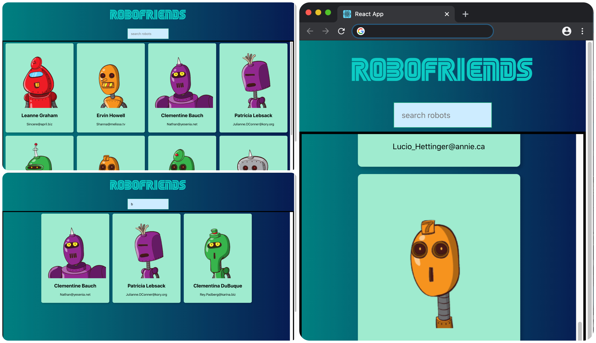

# RoboFriends

 

### This is a React tutorial on Udemy. (The Complete Web Developer in 2020: Zero to Mastery)

#### To run this project, click [Here](https://chansookim316.github.io/robofriends/) or

##### 1. Clone this repo

##### 2. Move the directory `cd robofriends`

##### 3. Run `npm install`

##### 4. Run `npm start`

 

 

## Technologies

####  Front-End

* HTML5

* CSS3

* React.js

####  Packages

* Create React App

* Tachyons

####  APIs

* [RoboHash](https://robohash.org/)

* [JSONPlaceholder](https://jsonplaceholder.typicode.com/)

